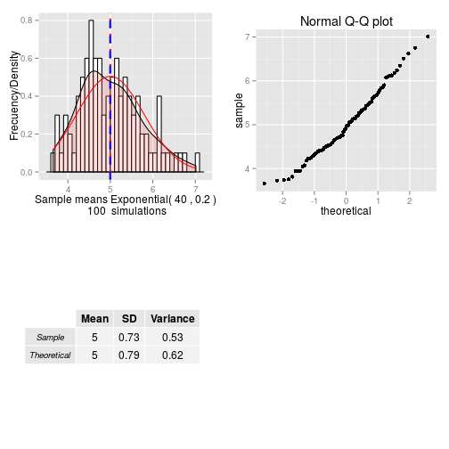

### Project overview
The central limit theorem says that the sample mean drawn from any parent population will tend towards being normally distributed as n, the size of the sample, grows larger.

The sample size needed so that the normal distribution reasonably approximates the sample mean varies from one type of distribution to another.

The goal of this app is simulate the distribution of averages of n exponential($\lambda$)s.

---
### Project description
The app show:

1. Where the distribution is centered at and compare it to the theoretical center of the distribution.
2. How variable it is and compare it to the theoretical variance of the distribution.
3. Show that the distribution is approximately normal.

The app allow set:

1. Parameter lambda ($\lambda$) for all simulations
2. Size of sample exponentials
3. Number of simulations

---

## Exponential distribution simulation output
This plot show some App graphics for exp(0.2) size 40 and 100 simulations.
Lines in red are theoretical values.

 

---

### Interactive SHINY web app

- Available at: https://jcalvocab.shinyapps.io/Exponential_Sample_Means_App

- App source code: https://github.com/jcalvocab/Exponential_Sample_Means_App.git

- Presentation: http://jcalvocab.github.io/Exponential_Sample_Means_App/

